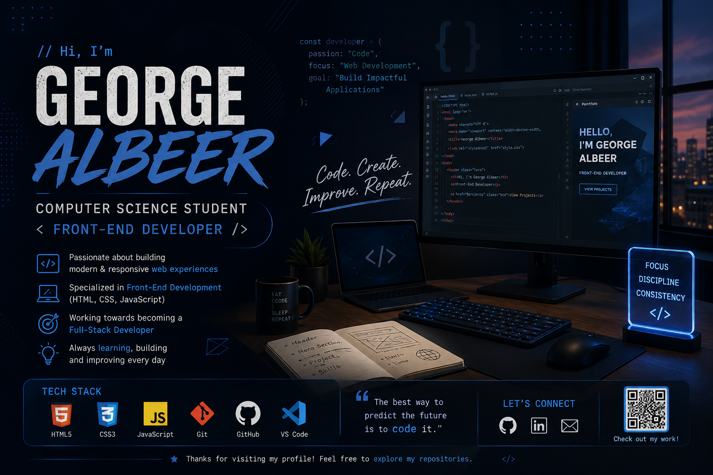

<p align="center">
  
</p>

<h1 align="center">👋 Hi, I'm George Albeer</h1>

<h3 align="center">
  💻 Computer Science Student | 🌐 Front-End Developer | 🚀 Future Full-Stack Developer
</h3>

<p align="center">
  <a href="https://github.com/geoboka7-design">
    
  </a>
  
</p>

---

## 👨‍💻 About Me

- 🎓 I'm a **Computer Science student** passionate about programming and software development.
- 🌐 I have studied **Front-End Development** and enjoy creating modern and responsive websites.
- 💻 My main focus is **Web Development**.
- 🚀 My goal is to become a **professional Full-Stack Developer**.
- 🧠 I enjoy learning new technologies and improving my programming skills.
- 🛠️ I believe the best way to improve as a developer is by **building real projects**.
- 🌱 Currently expanding my knowledge in **JavaScript and Back-End Development**.

---

## 🧑‍💻 Tech Stack

### 🌐 Front-End

<p align="left">
  
</p>

### 🛠️ Tools

<p align="left">
  
</p>

---

## 📚 Currently Learning

- ⚡ Advanced JavaScript
- 🔧 Back-End Development
- 🌐 APIs
- 🗄️ Databases
- 🚀 Full-Stack Web Development

---

## 🚀 Featured Project

### 🔥 Khedmetna

**Khedmetna** is a project I'm working on with a focus on creating a modern, useful, and user-friendly digital experience.

#### Current Focus

- 🎨 Modern UI/UX
- 🌐 Front-End Development
- ⚡ Interactive User Experience
- 📱 Responsive Design
- 🚀 Real-world functionality

---

## 💻 What I Like Building

```javascript
const george = {
    name: "George Albeer",
    field: "Computer Science",
    role: "Front-End Developer",

    skills: [
        "HTML",
        "CSS",
        "JavaScript"
    ],

    interests: [
        "Web Development",
        "Software Development",
        "UI/UX",
        "Programming"
    ],

    goal: "Become a Full-Stack Developer",

    mindset: "Learn • Build • Improve"
};
